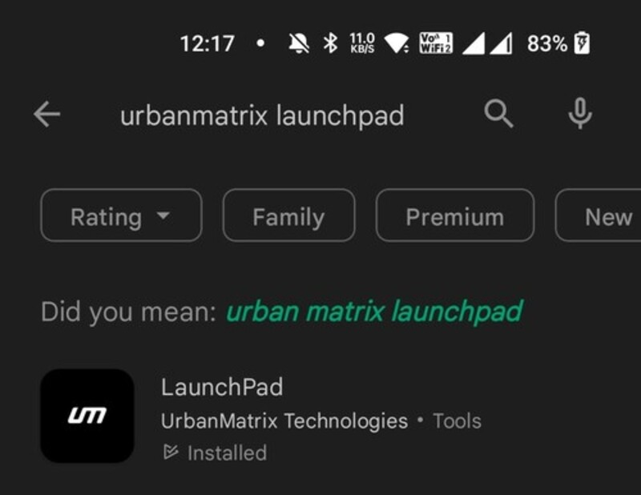
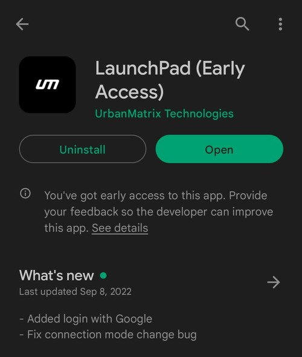

# Install

## Finding the Application

LaunchPad is currently available **only for Android** devices. It can be found on the **Google Play Store**.

Open the Google Play Store and type **umt launchpad** in the search bar. **UMT LaunchPad** should come up as the first
result.

## Installing the Application

Click on the `Install` button which is displayed in the image given above.
