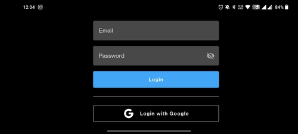

# Login

The above screen will be displayed when you install and launch the application for the first time. 

You can login with your **Google ID** and no separate registration process is required.

If you want to use some other ID apart from your Google ID, you can also register as a user on the **UMT Console** and
login using those credentials.
