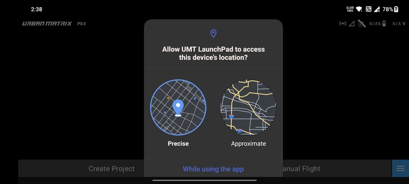
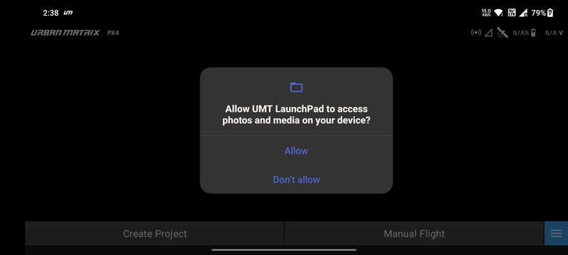

# Permissions

## Location Permission

After logging into to the application the first permission that is required is for location services. This permission is
required by the app to show the **user** location and **not the drone**. As you can see the app presents you with two
options.

- `Precise` - Ideal conditions can pinpoint you down to a meter.
- `Approximate` - Your location can be within 100 meters.

The user has three options to select from:

- `While using the app`
- `Only this time`
- `Don't allow`

## Media Permission

The app also requires is access to the photos and media. 

By granting this permission you will be able to import **KML** and **KMZ** files into the application. This will be further
explained in the coming pages. Also, you will be able to store the compressed versions of the drone camera pictures.
