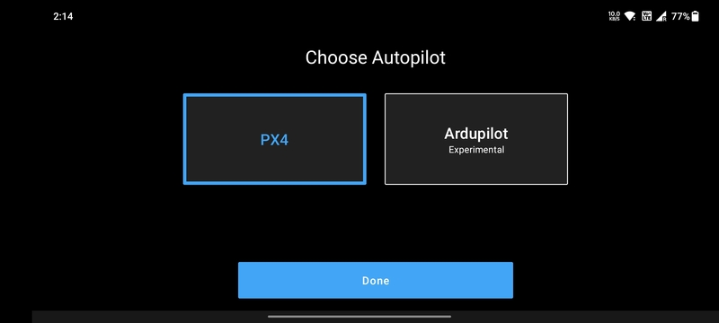
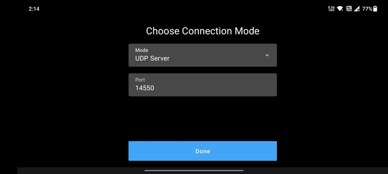
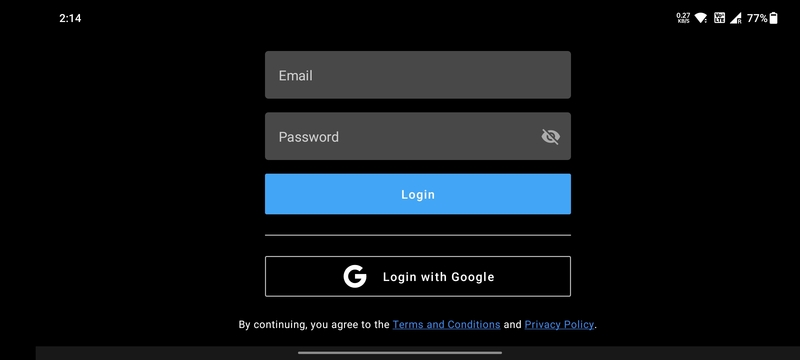

# Setup and Login

## Autopilot Selection

When the app is started for the first time, the users get to select between `PX4` and `Ardupilot` systems. Select the
autopilot system of your drone and click on the `Done` button. This can later be changed in the
[App Settings](../settings/app-settings.md).

## Connection Mode

The following connection modes are available:

- `UDP Server`
- `TCP Server`
- `TCP Client`
- `Serial`

## Login

You can login with your **Google ID** and no separate registration process is required.

If you want to use some other ID apart from your Google ID, you can also register as a user on the
[NextConsole](https://console.nextuav.co.in/login/signup/) and login using those credentials.

