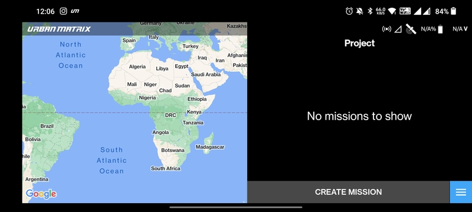
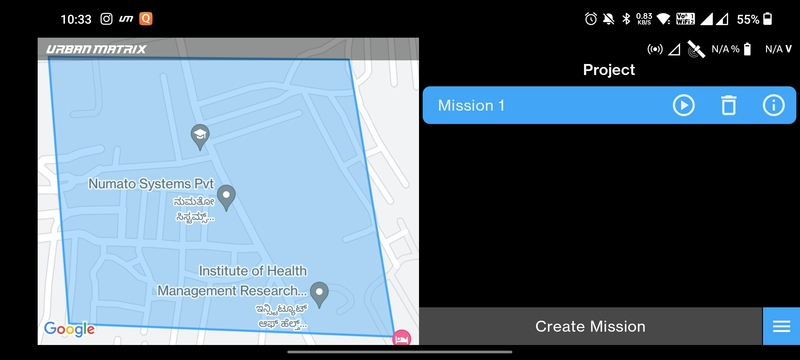
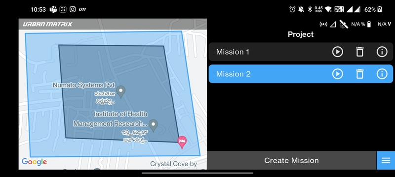
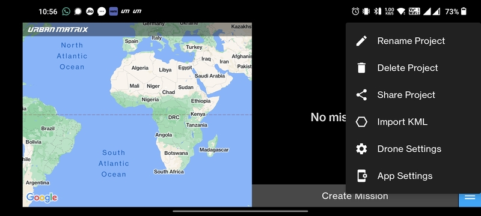

# Mission List Screen

When you tap on a project in the [Project List Screen](./project-list-screen.md) then the Mission List Screen gets
opened.

## Create Mission

LaunchPad currently offers 5 different types of automated missions:

- [Single Grid Photo](../mission-planning/single-grid-photo.md)
- [Double Grid Photo](../mission-planning/double-grid-photo.md)
- [Line Photo](../mission-planning/line-photo.md)
- [Line Video](../mission-planning/line-video.md)
- [Line Recon](../mission-planning/line-recon.md)

## Map

If you already have a mission created then the world map on the left will zoom into the location where the mission was
created. The below images depicts the same.

If you have multiple missions with polygons created in the same area the below image will depict how they will be
displayed. Tapping the mission you want to open will light up the corresponding polygon in blue color as shown in the
image below.

## Menu

As you can see there is a menu button on the bottom right corner of this screen. When tapped on, it shows the following
menu items.

- `Rename Project`
- `Delete Project`
- `Share Project`
- `Import KML` (Capable of importing KMZ as well)
- [`Drone Settings`](/launchpad/settings/drone-settings.md)
- [`App Settings`](/launchpad/settings/app-settings.md)

