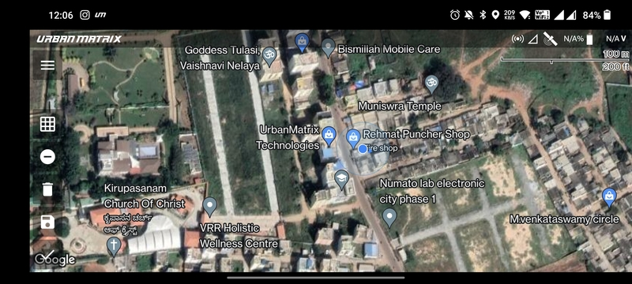
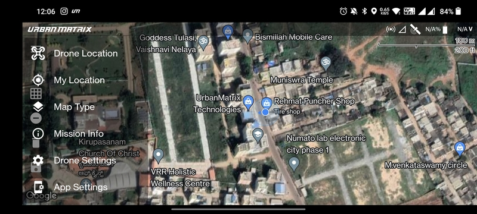
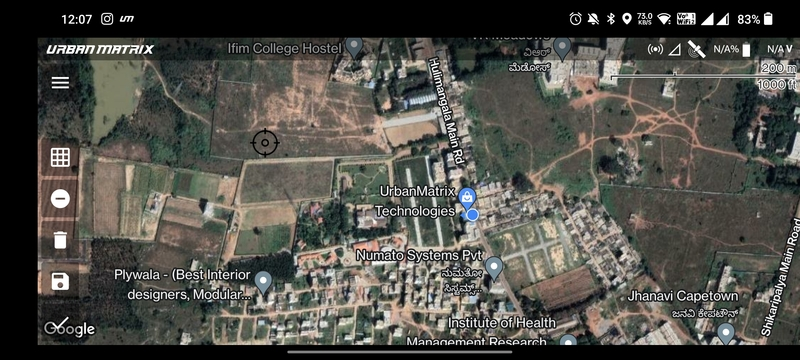
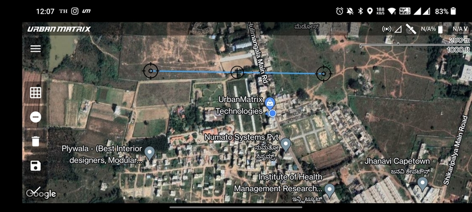
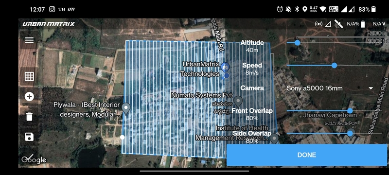

# Mission Planning Screen

As soon as you tap any mission type option or the play button of any mission in the
[Mission List Screen](./mission-list-screen.md) you are taken to the Mission Planning Screen. If user location is
available then the map gets zoomed into the user, otherwise you are zoomed into the previously planned mission.

## Menu

Top left corner has another menu button that opens up various options which are shown in the image given below.

- `Drone Location`: Zoom into the location of the drone.
- `My Location`: Zoom into the location of the transmitter.
- `Map Type`: Switch between satellite and normal map types.
- `Mission Info`: Information about the current mission.
- [`Drone Settings`](/launchpad/settings/drone-settings.md)
- [`App Settings`](/launchpad/settings/app-settings.md)

## Drawing Buttons

There are 5 other options right below the menu button. They are (from top to bottom):

- `Single tap Geo-fence`
- `Add/Remove Vertices`
- `Delete Drawing`
- `Save Drawing`
- `Proceed to Mission Parameters`

## Drawing Basics

All you have to do to create the drawing is ensure that the `Add/Remove Vertices` symbol is looking like a negative
sign. Then tap anywhere on the screen a black target looking icon will be displayed where you had tapped.

Next tap anywhere else on the map to add a new vertex. A blue line will be created which will join these two vertices.

Based on the mission type, you can either create a line or a polygon. These are covered in detail in the
[Mission Planning](/category/mission-planning) Section.

## Mission Parameter Sheet

Based on the mission type, the user is prompted different types mission parameters. These are covered in detail in the
[Mission Planning](/category/mission-planning) Section.

## Done Button

Once the planning is done, you can click the `Done` button to move on to the [Flight Screen](./flight-screen.md).
