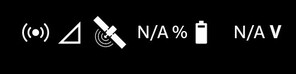
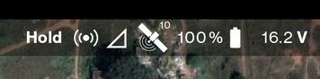
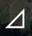
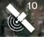
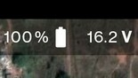

# Status Bar

The the status bar shows important parameters one should always check after switching on the transmitter and drone. Only
when the drone and transmitter are connected to one another, the data will be displayed on the top right corner of the
application.

Given below is the example of how the status bar will look when the drone is not connected to LaunchPad.

Given below is the example of how the status bar will look when the drone is  connected to LaunchPad.

## Components (from left to right)

### Flight mode

The first parameter is flight mode, in the above picture it is shown as `Hold`.

Given below are some of the flight modes available:

- `Hold`: It is a flight mode where the drone just keeps hovering at its position where the last command was issued and
  does not move around. It is liked the drone is glued to that particular spot in mid air.

- `POSCTL`: Stands for position control. When there are enough satellites connected with the drone GPS let us say a minimum of 10, the left switch on the transmitter can be toggled to `POSCTL` mode.

  In this mode the altitude of the drone and position of the drone are fixed until the user gives inputs using the
  sticks on the transmitter to move from its place.

  This is the very same mode in which automated missions are performed, so always check if the transmitter is
  put in POSCTL before executing any automated mission.

- `ALTCTL`: Stands for altitude control. In this mode the drones altitude is fixed and its keeps moving in that altitude
  as it does not use satellites. Therefore even a tiny gust of wind can quickly alter the drones position.

  The pilot should always be focused on the drone when flying in this mode.

- `Mission`: This is the flight mode that will be shown when the drone is performing an automated mission.

- `RTL`: This is the flight mode that will be shown when the drone is performing a return to launch.

  RTL can be manually triggered by the pilot from the transmitter or remotely from the NextConsole, or
  automatically when the battery percentage touches 15%.

### LTE signal strength

*This feature is only available to UMT drone or MatrixCC users.*

The third icon from the left which can be seen in our cellphones represents exactly the same thing in the transmitter as
well which is the mobile network strength symbol.

From the above image it is clearly seen that there is no 4G Signal connectivity are the symbol is not solid filled
white.

Since UMT Drones are the only drones having 4G capabilities, it is essential that the drone is flown in areas where
there is good 4G network connectivity. Though this is **not required** to fly the drones, this will ensure that various
parameters of the drone such as altitude, speed, etc., along with the live video feed of the drone camera will be
transmitted to NextConsole and viewed anywhere in the world.  

### Satellite connectivity

The tiny number right beside the symbol which looks like a satellite depicts the number of satellites connected to the
drone at the moment.

For example, in case of the image right above the number displayed is 10. meaning that 10 satellites are currently
connected to the drone.

### Battery percentage and voltage

The last status you need to keep track of is the battery voltage.

Never try to fly a drone that does not have enough charge. As it can lead to the mission being incomplete due to RTL
being triggered because of low battery. This can degrade the battery and reduce the number of life cycles it can
actually provide.
