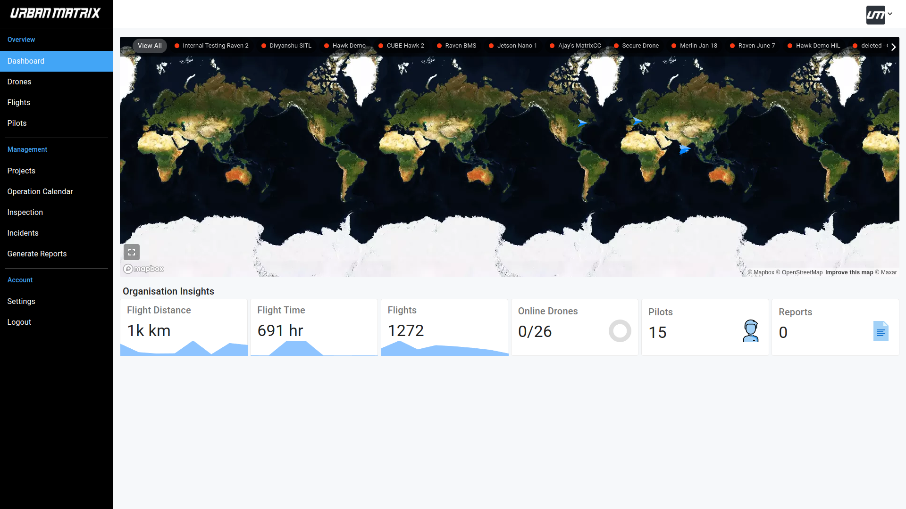
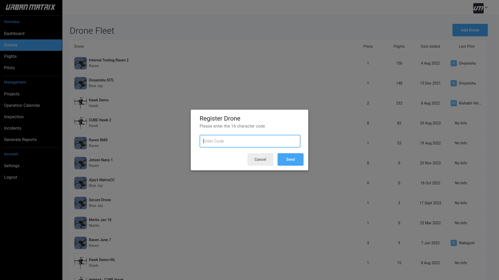
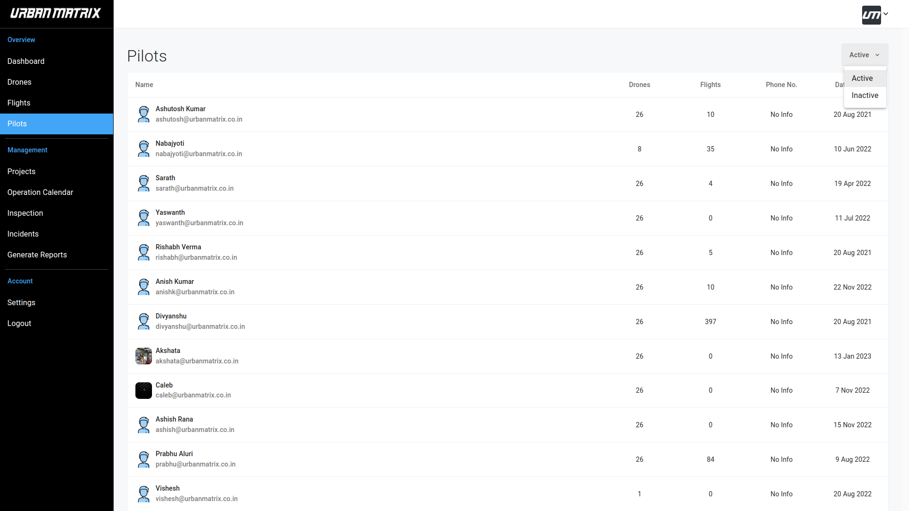
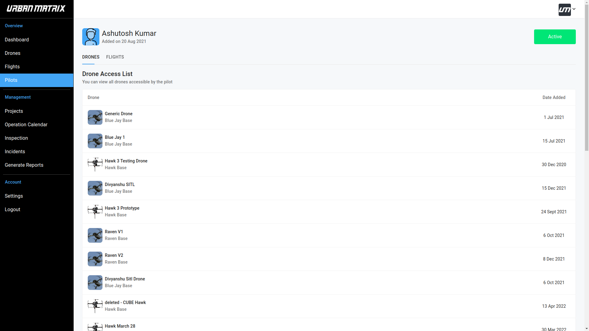

# Overview Dashboard

## Organisation Insights

- Flight Distance : Summation of the total distance covered by all your drones. 
- Flight Time : Summation of the total flight time of all your drones. 
- Flights : Total number of flights. 
- Online Drones : Number of drones online by total number of registered drones. 
- Pilots : Total number of ACTIVE pilots. 
- Reports : Total number of reports generated. 

Find more details about fleet management [here](/docs/matrix-console/features/fleet-management.md)  

## Drone Fleet

- This page gives a tabular visualisation of all your drones. 
- Clicking on a specifc drone shows its Flight Log History. This is explained in detail [here](/docs/matrix-console/features/flight-log-history.md) 

## Register Drone

- You register a new drone by clicking on "Add Drone".
- Please enter the 16 character code that was generated by UrbanMatrix Technologies and provided to you at the time of purchase.
- Click on "Send"

# Flights

- This section displays flight data for your drones in a tabular format.
- You can sort this data on the basis of flight status.
- Clicking on a specific path taken by the drone shows crucial Flight Details.
- You can also generate a report of your flight. This is explained in detail [here](/docs/matrix-console/features/report.md) 

# Pilots

- Details of all pilots will be displayed here. 
- This data can be sorted on the basis of active and inactive pilot accounts. 

- Selecting a pilot's profile will display all their information and the list of drones they have access to.
