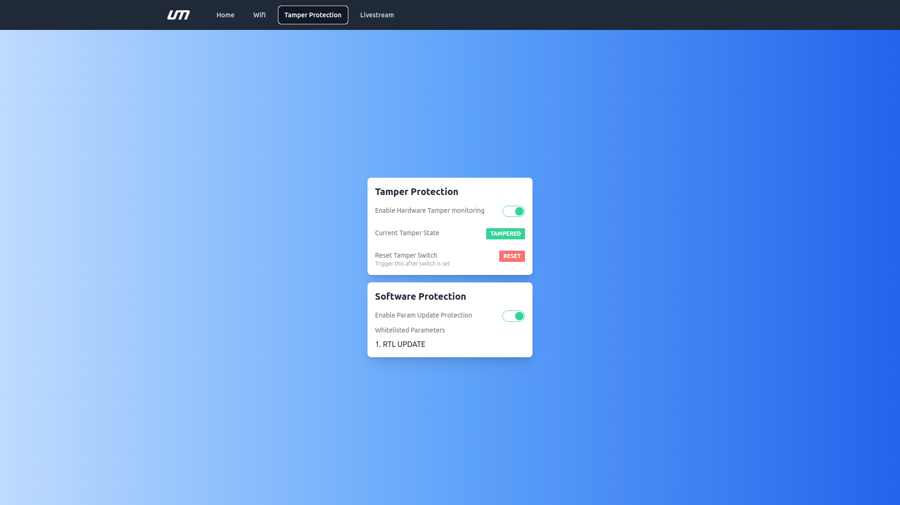

# Tamper Protection Screen

- Please ensure that the tamper proof module is connected to the [MatrixCC](/docs/matrixcc/integration.md)
- Your tamper proof module must have a switch soldered to the correct pins [S1 & S2] 
- Please refer to the first time setup to open the [MatrixOS Dashboard](/docs/matrix-os/getting-started/first-time-setup.md)

## Enable Hardware Tamper monitoring

- Click on 'Enable Hardware Tamper monitoring' 

## Tamper State

### Tampered 

### Untampered 

### Reset 

*Note: Trigger this after switch is set* 

### Test 

- Hold the switch in your hand and enable the tamper monitoring option. The status must be 'untampered'
- Release the switch and check if the status changes to 'tampered' 
- Click on reset 