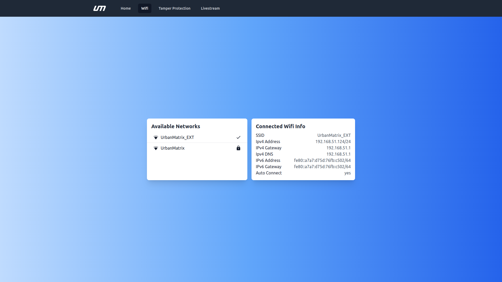

# Wifi Screen

## Available Networks

- A list of wireless networks that the MatrixCC is able to detect and potentially connect to.
- This list typically includes connection status and signal strength of each network.

## Connected Wifi info

- Information about the wifi network that the MatrixCC is currently connected to. 
- This can include 
    - The network's name (SSID)
    - Ipv4 Address & Gateway
    - IPv6 Address & Gateway
    - Ipv4 DNS
    - Auto Connect

