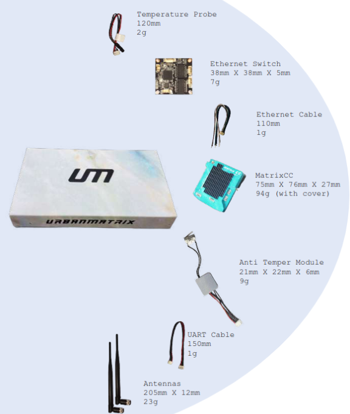

# What's in the box?

## Matrix CC

MatrixCC is an indigenous Companion Computer that is an addition to a usual flight controller. It transforms your drone to a 4G enabled drone system with endless new possibilities.

## Antennas

The antennas are a crucial component along with the MCC to extend the range of the wireless signal and improve its quality, allowing for better connectivity and faster data transfer speeds. 

## Cables

 - UART
 - JST with lock
 - Power cable for MCC 

## Tamper Proofing Solution (optional)

A tamper-proof system will prevent the drone from taking off if any tampering is detected, such as opening the top, bottom, or side plates. If tampering is detected, the drone's warranty will become void. To regain the ability to take off, the user must contact the manufacturer.

## Network Hub (optional)

An Network Hub connects multiple devices to the same network by physically connecting them to the switch using cables. Once a device is connected to a port on the switch, it manages the flow of data between the connected devices by directing incoming and outgoing data to the correct port based on the device's IP address.

