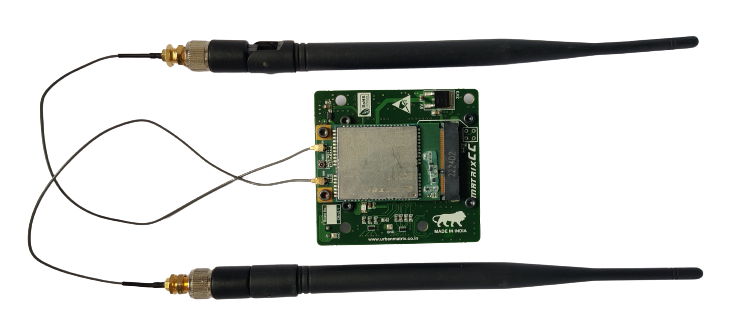
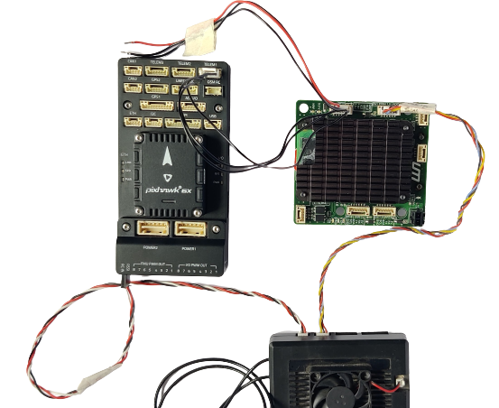
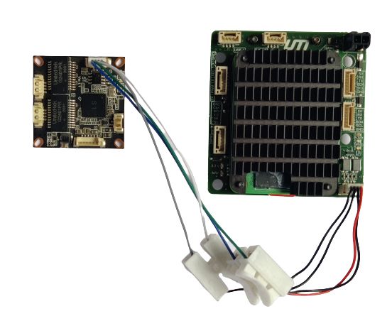
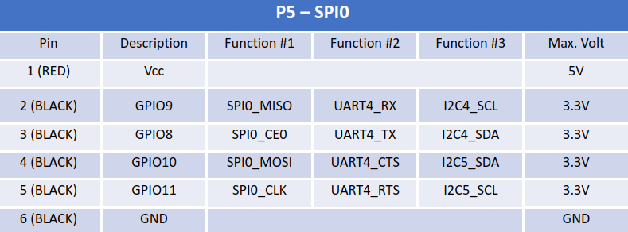

# Integration

In this section you'd find the integration of main components.

*Note: Ensure that you've inserted the SIM card properly.*

## ANTENNAS

- Connect the 2 antennas of the cellular module (MAIN | DIV)
- For simplicity the antennas have been removed in the following sections.

## P1 : FLIGHT CONTROLLER

- Cable : 6 pin
- Connect the P1 port to your autopilot on the TELEM port.
- Baud rate = 57600

Please refer to the pin out diagram below [*Note- 5V, CTS & RTS have been disconnected to avoid signal fluctuations*]

## P2 : RADIO LINK

- Cable : 6 pin
- Connect the P2 port of the NextCC to the air unit using a UART cable.
- *Standard Connection:* Connect the air unit to your autopilot.

Please refer to the pin out diagram below. [*Note- Rx Tx may be swapped*]

### Herelink

### MK15

## P3 : POWER

- Cable : Power Connector
- Power requirements : 5V | 2A (max)
- Use the power connector given in the box to power the NextCC.
- Always plug in antenna before powering on​

## P4 : NETWORK HUB (optional)

- Cable : 4 pin
- Connect the P4 port of the NextCC to the P1 port of the Network Hub.

## P5 : TAMPER PROOF MODULE (optional)

- Cable : 6 pin
- Connect the tampering proofing module to the port P5 using the cable given in the box.
- Connect the trigger module to the S1 and S2 ports.

## PAYLOAD (optional)

This section explains the integration of NextCC with an IP camera. To illustrate an example the IP camera used is a SIYI MK15 IP67.

### IP camera

- An IP camera, or Internet Protocol camera, can transmit and receive data via a computer network and the internet.
- Connect it to the network hub.
- In case of the SIYI MK15 IP camera, connect the wire of the camera to the P4 port of the Network Hub.
- Connect the air unit to the network hub [to receive the video feed on [launchpad](/launchpad/introduction.md)]

