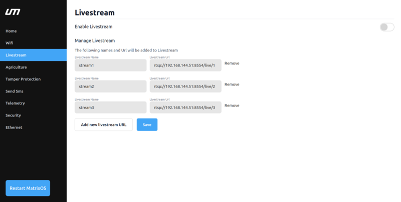
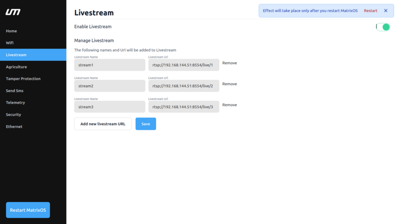
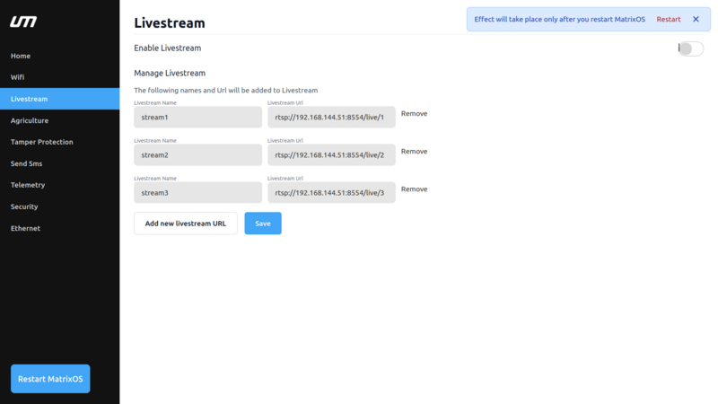
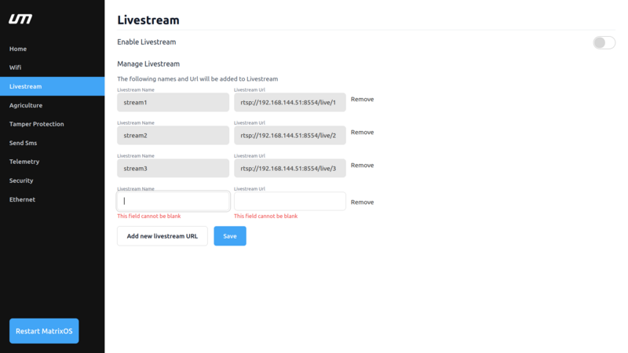
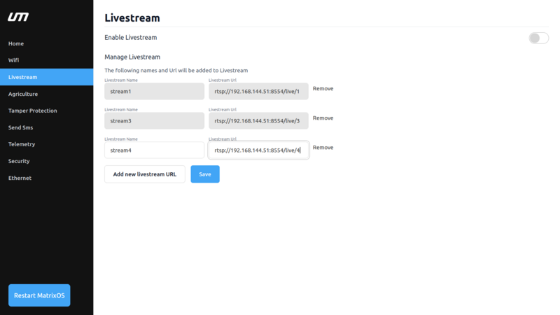
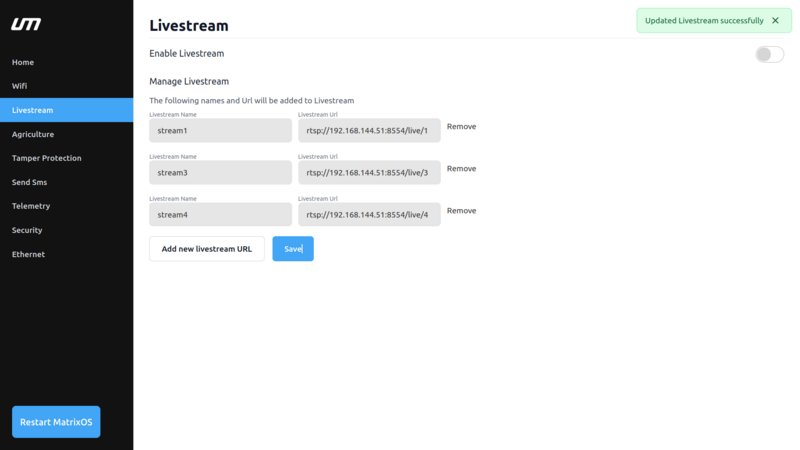

# Livestream

Select the `Livestream` feature in the NextOS Dashboard Sidebar to see options available for videostreaming. 

Livestreaming drone footage to nextconsole is a powerful tool that allows to view real-time aerial video footage 
from their drone, providing a unique perspective that is useful in a variety of applications, such as inspection, 
surveillance, and search and rescue. By connecting your drone's camera to a compatible console, you can stream 
high-quality video footage in real-time, enabling you to monitor the situation as it unfolds, make critical decisions, 
and respond quickly to any changes in the environment. Livestreaming drone footage to a console is an excellent way 
to leverage the full capabilities of your drone, and can help you achieve your goals more efficiently and effectively.

<!-- - Please refer to the first time setup to open the [MatrixOS Dashboard](/matrix-os/getting-started/first-time-setup.md) -->

## Features
  
The following features are available:

- `Enable livestream`
- `Manage livestream`

### Enable Livestream

Toogle the `Enable Livestream` to enable Livestream.This lets NextOS to read the Livestream URLs and 
begin video streaming over console.
*Note* : If toogle is green that means Livestream is enabled else disabled.

To enable Livestream, click the 'Enable Livestream' button.This allows NextOS to read the Livestream URLs and start video streaming through the interface.
*Note: If the toogle is green, Livestream is enabled; otherwise, it is disabled.

When you activate the toggle under Enable Livestream section, NextOS will be able to read the Livestream URLs and 
begin video streaming.

*Note* : If there is no Livestream URLs, you need to add new livestream   

**Note**: After enabling livestream, restart NextOS Dashboard. 

### Disable Livestream

When you deactivate the toggle under Enable Livestream section, NextOS will not read the Livestream URLs and 
stop video streaming.

**Note**: After diabling livestream, restart NextOS Dashboard. 

### Manage Livestream

You can add or remove livestream name and URLs depending on your requirements.

### Steps to add new livestream :

  - Click on add new livestream URL. Two text boxes will appear, labelled Livestream Name and Livestream URL.

  - You must fill in the blanks with the necessary information.

  
*Note* : Be cautious while filling the livestream URL.

### Save Livestream URL

It lets users to save the newly added URL and name.

## Usage

After enabling/disabling the Livestream feature, make sure to restart the NextOS Dashboard for 
the changes to take effect.

To add a new livestream, provide the livestream name and URL in the Manage Livestream section.

To remove an existing livestream, select the desired livestream from the list and click on remove button.

