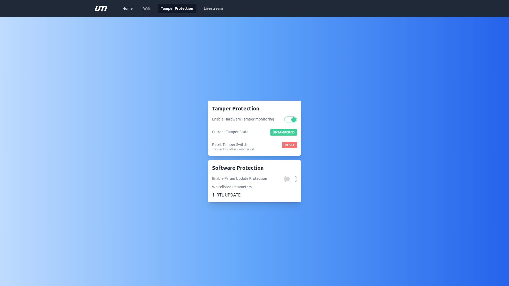

# Tamper Protection Screen

- Please ensure that the tamper proof module is connected to the [NextCC](/docs/next-cc/getting-started/integration.md)
- Your tamper proof module must have a switch soldered to the correct pins [S1 & S2]
- Please refer to the first time setup to open the [NextOS Dashboard](/docs/next-cc/getting-started/first-time-setup.md)

*Ensure that you RESTART the NextCC if you enable/disable any feature.*

## Enable Hardware Tamper monitoring

- Click on 'Enable Hardware Tamper monitoring'

## Tamper State

### Tampered

### Untampered

### Reset

*Note: Trigger this after switch is set*

### Test

- Press the switch and enable the tamper monitoring option. The status must be 'untampered'
- Release the switch and check if the status changes to 'tampered'
- Click on reset
