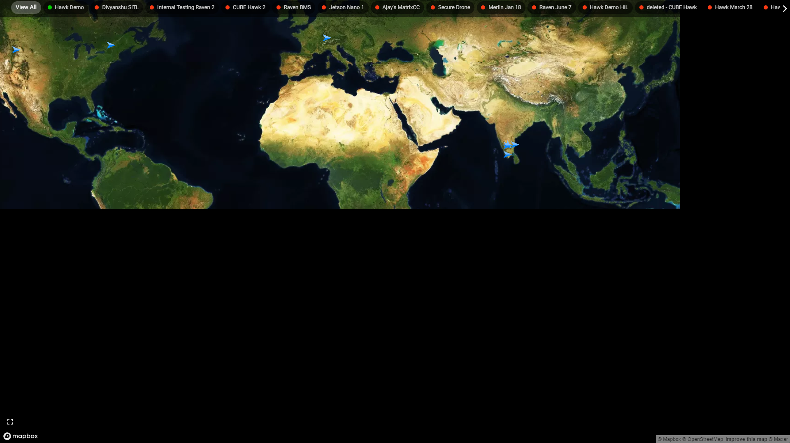

# Fleet Management

## View All

- Selecting "View All" will zoom out the map to show all the registered drones on a single screen.
- A GREEN dot on a drone's name indicates that the drone is **online**, while a RED dot signifies that it is currently **offline.**

## Drone

- Selecting a specific drone on the map will zoom in to its last known location.
- A box will appear on the bottom right of the map, displaying details of the drone and its last flight.
- If the drone is currently online, real-time data will be displayed.

## Tracking

- After selecting a particular drone and clicking "Live track" at the bottom of the box will redirect you to a new page containing the live drone feed and telemetry data of the drone.
- You can control the drone remotely and send 3 commands. This is explained in detail [here](/docs/next-console/features/flight-operations.md)

## Full Screen

The "Full Screen" option will expand the map to fill the entire screen, providing a larger view of the map.

> Use this on your big monitor when your eyes are tired of the tiny texts :) .

